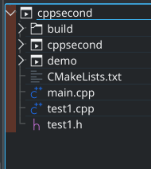

# 在KDEVELOP中创建C++工程后添加库文件

**前言**：此文主要介绍如何添加静态库文件和动态库文件


## 什么是库文件

一般来说，一个程序，通常都会包含`目标文件`和若干个`库文件`。经过汇编得到的目标文件再经过和库文件的链接，就能构成`可执行文件`。库文件像是一个代码仓库或代码组件的集合，为目标文件提供可直接使用的变量、函数、类等。

库文件包含了`静态链接库`和`动态链接库`两种。两者最根本的区别在与在程序编译的过程中，如何处理库文件和目标文件的链接关系。


静态库，动态库区别来自[链接阶段]如何处理库，链接可执行程序。分别称为静态链接方式、动态链接方式。


### 静态链接库

静态链接库在`Linux`系统中以`.a文件`的形式存在。

在上图程序编译的**链接阶段**，**静态库会完全复制到可执行文件中**，一旦可执行文件构建完成，就不再需要静态库的存在，可执行文件在后续的使用中，也不再依赖这个静态库。

### 动态链接库

虽然静态库非常容易理解且不会引入依赖问题，但是试想一下，如果你在统筹构建一个无比庞大的工程，这时，其中一个开发者升级了他所开发的库。这时，你就需要花费很长的时间来重新构建这个如此庞大的工程。这时，你就可以使用动态库来避免这个问题。

动态库在程序编译的链接阶段，**仅将一些重要的信息，如重定位和符号表信息复制到可执行文件中**，可执行文件在后面执行的过程中，如果需要引用这个库文件，就会根据这些信息从系统中寻找对应的库文件以实现对应的功能。

### 静态库与动态库区别

|      区别      |                            静态库                            |                            动态库                            |
| :------------: | :----------------------------------------------------------: | :----------------------------------------------------------: |
| 可执行文件大小 |   较大<br />（因为动态库的内容会被完全复制到可执行文件中）   |                             较小                             |
|  占用磁盘大小  | 较大<br />（如果有多个可执行文件都用到同一个静态库，这个静态库会被多次复制到不同的执行文件中） | 较小<br />（即使多个可执行文件都需要用到同一个动态库，他们也只共用同一个动态库文件） |
| 拓展性与兼容性 | 全量更新<br />（库文件的更新会引起整个可执行文件的重新编译） | 增量更新<br />（不需要重新编译可执行文件，只需发布动态库文件） |
|    依赖问题    |  无依赖问题<br />（已构建的可执行文件不依赖其他静态库文件）  | 有依赖问题<br />（可执行文件的执行需要系统存在依赖的动态库文件） |
|    复杂程度    |                             简单                             | 复杂<br />（需要处理很多问题，例如如何在允许时确定地址，库文件版本的管理等） |
|    加载速度    |                              快                              |                              慢                              |

## 如何在CMake中添加库文件

示例C++工程如下，包含一个主程序文件和一个库文件



main文件里只有一个简单的程序，是用extern调用外部文件（**PS**：之所以写这个文档也是因为在用extern时出了bug才想到构建库文件链接）	

```c++
#include <iostream>
#include "test1.h"

int main(int argc, char **argv) {
    a=3;//来自外部文件
    b=4;//来自外部文件
    std::cout << "Hello, world!" << std::endl;
    return 0;
}
```

使用CMake来构建MakeFile，并将指定的源文件制作为静态库和动态库。打开CMkeLists文件。

```cmake
cmake_minimum_required(VERSION 3.0)

#设置项目名
project(cppsecond)

# 添加头文件搜索路径，可以通过添加‘/’的方法继续打开文件夹内的路径
include_directories(
${PROJECT_SOURCE_DIR}
)

#生成静态库
add_library(demo STATIC test1.cpp) #demo表示把该库文件归到哪一个集合里，无实际意义，STATIC表示静态，test1.cpp是源文件
#生成动态库
##add_library(demo SHARED src/printer_int.cpp) #demo表示把该库文件归到哪一个集合里，无实际意义，SHARED表示动态，test1.cpp是源文件

# 添加需要构建的可执行文件
#------方法对比 1.1 - 不用库的写法
##add_executable(cppsecond main.cpp test1.cpp) #cppsecond表示把该文件归到哪一个集合里，无实际意义，test1.cpp是库文件

#------方法对比 1.2 - 用库的写法
add_executable(cppsecond main.cpp)
target_link_libraries(cppsecond PRIVATE demo)   # 为目标添加静态库，此处动作为‘链接’库，关于PRIVATE关键字，请看下文解释

install(TARGETS cppsecond RUNTIME DESTINATION bin)

```

然后执行编译来生成库文件和可执行文件即可，或者进入CMakeLists的文件夹执行cmake，再在工程文件夹下执行make。

**再次强调**：静态库编译完后就没有什么用处了，动态库要一直保留


## CMake 中 target_link_libraries 的 PRIVATE，PUBLIC 和 INTERFACE 的区别

|               情况               | 使用参数  |
| :------------------------------: | :-------: |
| 只有源文件（.cpp）中包含了库文件 |  PRIVATE  |
| 只有头文件（.hpp）中包含了库文件 | INTERFACE |
|   源文件和头文件都包含了库文件   |  PUBLIC   |

再用大白话解释一遍：

- 如果源文件(例如CPP)中包含第三方头文件，但是头文件（例如hpp）中不包含该第三方文件头，采用**PRIVATE**。
- 如果源文件和头文件中都包含该第三方文件头，采用**PUBLIC**。
- 如果头文件中包含该第三方文件头，但是源文件(例如CPP)中不包含，采用 **INTERFACE**。

